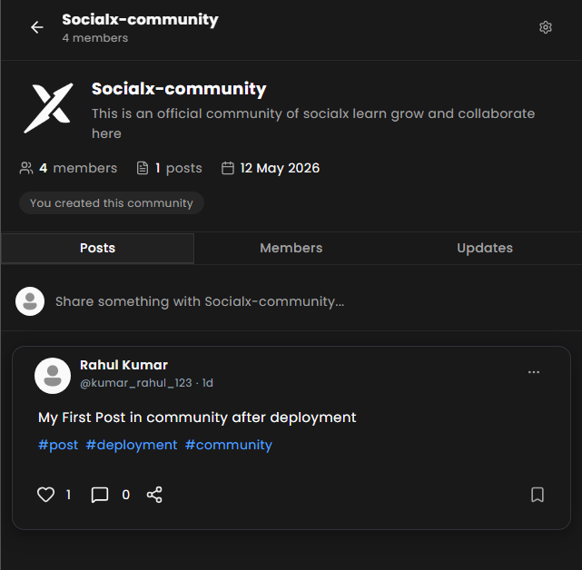

# SocialX

A next-generation social networking platform designed for developers — enabling seamless interaction, real-time engagement, and structured community collaboration.

## 📌 Overview

SocialX is a feature-rich social networking application where users can connect, share posts, join topic-specific communities, and engage with peers in real time. The project focuses on scalability, clean UI/UX, secure authentication, optimistic interactions, and a fully responsive design across all devices.

---

# 📷 Screenshots

<p align="center">
  
  
</p>

<p align="center">
  
  
</p>

<p align="center">
  
</p>

## ✨ Features

- 🔐 JWT Authentication, Google OAuth and Email Verification
- 👤 User Profiles with Bio and Avatar
- 📝 Rich Text Post Creation with Image Uploads and Topic Tags
- ❤️ Like and Bookmark System with Optimistic UI
- 💬 Threaded Comments with Like Support
- 👥 Follow / Unfollow with Friend Suggestions
- 🏘️ Communities — Create, Join, Post, and Moderate Topic-Specific Groups
- 🔔 Real-Time Notifications via WebSockets (Likes, Comments, Follows, Community Activity)
- 📨 Weekly Email Digest for Top Posts (via Resend SDK)
- 🧹 Automated Notification Cleanup via Cron Jobs
- 📱 Fully Responsive Design across Desktop and Mobile
- ⚡ Optimistic UI Updates with Automatic Rollback on Failure
- 🌐 Global Feed and Personalized Following Feed

---

## 🛠️ Tech Stack

### Frontend

- TypeScript
- React + Vite
- Tailwind CSS
- Zustand (Client State)
- TanStack Query (Server State)
- Socket.io Client (Real-Time)
- Axios

### Backend

- TypeScript + Zod (Validation)
- Node.js
- Express.js
- MongoDB + Mongoose
- Socket.io (WebSockets)
- JWT Authentication
- Resend SDK (Transactional Emails)
- Cloudinary (Media Storage)
- Node-Cron (Scheduled Jobs)
- Multer (File Uploads)

### Deployment

- AWS EC2 Instance
- Cloudflare DNS Management
- Nginx

---

## ⚙️ Installation

### 1️⃣ Clone Repository

```bash
git clone https://github.com/your-username/socialx.git
```

### 2️⃣ Install Frontend Dependencies

```bash
cd socialx-frontend
npm install
```

### 3️⃣ Install Backend Dependencies

```bash
cd SocialX-backend
npm install
```

---

## 🔑 Environment Variables

Create a `.env` file inside the `SocialX-backend` folder:

```env
PORT=5000
MONGO_URL=your_mongodb_uri
CLOUDINARY_CLOUD_NAME=your_cloudinary_cloud_name
CLOUDINARY_API_KEY=your_cloudinary_api_key
CLOUDINARY_API_SECRET=your_cloudinary_api_secret
FRONTEND_URL=localhost_or_deployed_url
NODE_ENV=production_or_development
ACCESS_TOKEN_SECRET=your_access_token_secret
REFRESH_TOKEN_SECRET=your_refresh_token_secret
GOOGLE_CLIENT_ID=your_google_oauth_client_id
GOOGLE_CLIENT_SECRET=your_google_oauth_client_secret
RESEND_API_KEY=your_resend_api_key
```

Create a `.env` file inside the `socialx-frontend` folder:

```env
VITE_API_URL=your_api_url
VITE_GOOGLE_CLIENT_ID=your_google_oauth_client_id
VITE_GOOGLE_CLIENT_SECRET=your_google_oauth_client_secret
VITE_SERVER_URL=your_backend_url_with_port
```

---

## ▶️ Running the Project

### Start Backend

```bash
cd SocialX-backend
npm run dev
```

### Start Frontend

```bash
cd socialx-frontend
npm run dev
```

---

## 🏘️ Community Feature

SocialX introduces structured Community Spaces that go beyond the global feed:

- **Create Communities** around academic subjects, career topics, campus life, or technical domains
- **Join and Leave** communities freely with real-time member count updates
- **Community Feed** — isolated from the global feed to maintain content relevance
- **Real-Time Alerts** — members receive instant notifications when new posts are published in their communities
- **Moderation Rights** — community creators can remove members and delete posts
- **Community Discovery** — browse and join new communities from the Explore page

---

## 🚀 Future Improvements

- Real-Time Chat between users
- Story Feature
- Video Uploads
- AI-Powered Content Recommendations
- Invite-Only Communities
- CI/CD With Docker & Kubernetes

---

## 🤝 Contributors

- Meet Mishra
- Nakshatra Agrawal
- Krishna Joshi

---

## ⭐ Support

If you like this project, give it a ⭐ on GitHub!
